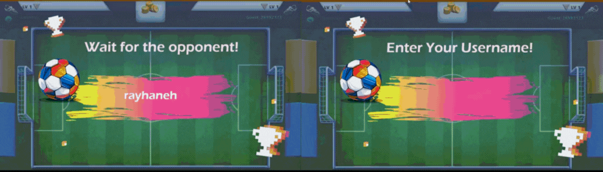

A multiplayer version of **Soccer Stars** with a **C++ server** for networking and a **Python client** for gameplay.  
The server manages connections and synchronizes the game state, while each client handles rendering and player input.

---

## 🏗️ Project Structure
- **server/** → C++ code for the game server (handles connections, turns, and state updates).  
- **client/** → Python code (Pygame) for rendering the board, player input, and local game logic.  

---

## 🎮 Features
- Multiplayer over TCP sockets  
- Supports **2 or more players**  
- Centralized C++ server synchronizing game state  
- Python client with Pygame interface  
- Turn-based kicking mechanics  
- Real-time score updates

  

---
<a href="https://github.com/Rayhaneh-Einollahi/networked_Soccer_Stars" target="_blank" rel="noopener" 
   style="display:inline-block; padding:12px 24px; font-weight:bold; background-color:#24292e; 
          color:white; border-radius:8px; text-decoration:none; font-size:16px;">
  ⭐ Star on GitHub
</a>

---

