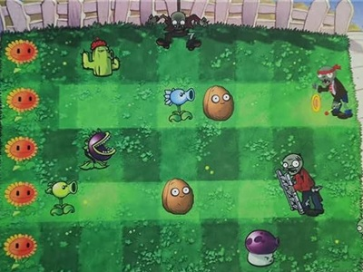

An object-oriented C++ implementation of classic **tower defense** game using SFML for graphics and gameplay.

--- 

  

---
<a href="https://github.com/rayspring2/plant.vs.zombie" target="_blank" rel="noopener" 
   style="display:inline-block; padding:12px 24px; font-weight:bold; background-color:#24292e; 
          color:white; border-radius:8px; text-decoration:none; font-size:16px;">
  ⭐ Star on GitHub
</a>

---

